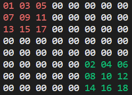

# Консольная игра Уголки

## Цель проекта
Тренировка навыков программирования на Python.

## Об игре 
Есть поле 8 на 8 клеток, оно заполнено числами. Первый игрок может передвигать нечетные(красные), второй четные(зеленые). Передвигать число можно на соседнюю пустую клетку("00") или перепрыгивать через другое число. Цель: первым переместить свои числа в противоположный угол.

 
